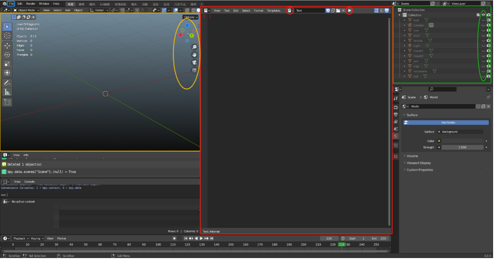

# Code Execution Guide

## I. Overview

1. This guide provides instructions on how to use the code for GCN-Polycube classification and GCN-Centroid prediction (including K-means segmentation) as described in paper [1].

2. Throughout the workflow, three programs from paper [2] are used: `Polycube2024.exe`, `ParametricMapping.exe`, and `Hex2spline`. `Polycube2024.exe` is used to convert segementation obtained via the DL-Polycube algorithm and K-means algorithm into segmentation readable by GCN-Centroid. Its purpose is to eliminate duplicate segmentation parts , e.g., two separated parts initially numbered 1 will be changed to part 1 and part 2 after processing. Note that the CVT function in `Polycube2024.exe` is not used. `ParametricMapping.exe` combines segmentation and polycube obtained by the DL-Polycube algorithm to generate a hex mesh, while `Hex2spline.exe` is used to generate splines. Detailed explanations of these external programs' code can be found in prior articles, and readers can refer to reference [2] for a better understanding.

3. The implementation of this code is mainly based on the Python language and 3D software Blender, using Python third-party libraries and Blender's built-in libraries. Below is a list of Python third-party libraries and Blender information used in this workflow.

| Environment/Library/Software | Version      | Description                                            |
|------------------------------|--------------|--------------------------------------------------------|
| Blender                      | 3.0          | Built-in libraries `bpy` and `bmesh`.                  |
| Python                       | 3.9          | -                                                      |
| NumPy                        | 1.23.5       | Consistency in version is recommended to avoid issues. |
| Pandas                       | 1.4.2        | -                                                      |
| Torch                        | 1.10.1+cu102 | -                                                      |
| Torch Geometric              | 2.5.3        | Needs to be compatible with PyTorch version.           |

4. **Introduction to Blender Interface and Basic Operations:**

   The image below shows the basic Blender interface. In this code workflow, we mainly focus on three areas: the viewport (3D Viewport) outlined in yellow, the code area (Text Editor) outlined in red, and the file area (Outliner) outlined in green. Also, the File button outlined in blue is important. Below is an introduction to their uses:

   - **Yellow rectangle (Viewport):** Used to display the model and adjust the current view. The yellow oval area achieves view adjustments. Drag the top coordinate axis in the yellow oval with the mouse to rotate the view; similarly, drag the magnifying glass icon to zoom, and drag the hand icon to move the view. These operations allow you to inspect model details in the viewport.

   - **Red rectangle (Code Area):** Used for switching, browsing, and running code. The left red oval outlines a booklet-like icon for switching between different code files, while the right red oval outlines a triangle icon for executing code.

   - **Green rectangle (File Area):** Lists all current models. Focus on the eye icon outlined in the green oval to show/hide models. Double-click the model name with the mouse to rename it.

   - **Blue rectangle (File):** Click this when importing models. For example, to import an FBX file, click `File -> Import -> FBX (.fbx)` and select the desired FBX file to import.

5. **Explanation of Subdirectories in This Directory:**

   | Subdirectory           | Purpose                                                                                 |
   |------------------------|-----------------------------------------------------------------------------------------|
   | adjacent_relationships | Stores adjacency relationships of various test models, mainly for merging corner nodes. |
   | data                   | Stores and calls model information for PyTorch.                                         |
   | mesh_file              | Run `Polycube2024.exe` and `ParametricMapping.exe` here, and save .k and .hex files.    |
   | model                  | Stores test models in FBX format.                                                       |
   | model_parameter        | Stores neural network parameters used by PyTorch.                                       |
   | param                  | Stores adjustable parameters for each test model.                                       |
   | src                    | Stores source code.                                                                     |
   | text                   | Stores various intermediate files output during the code process.                       |

## II. Execution Process

The overall code is divided into two parts: one is to execute Python files directly, and the other is to execute Python-based scripts within Blender.

Before executing the code, there are two preparation steps:

- First, double-click to open the Blender file in the `src` directory.
- Second, import the model into Python. As mentioned earlier, use `File -> Import -> FBX (.fbx)` to import a model from the `model` directory into Blender. Note the imported model's name (check the file area); if the name is not `test`, rename it to `test`.

After preparation, you can start executing the code. The table below lists the execution order:

| Step Number | Specific Execution Content                                                                                                                                                                                                                                         |
|-------------|--------------------------------------------------------------------------------------------------------------------------------------------------------------------------------------------------------------------------------------------------------------------|
| 1           | Execute File 1 in Blender.                                                                                                                                                                                                                                         |
| 2           | Execute Python files 2 and 3.                                                                                                                                                                                                                                      |
| 3           | Use the `Polycube2024.exe` program in the `mesh_file` directory. Open the command line, and input `Polycube2024.exe -i test.k -o test_polycube_structure.k -c 1`.                                                                                                  |
| 4           | Execute File 5 in Blender.                                                                                                                                                                                                                                         |
| 5           | Execute Python file 6.                                                                                                                                                                                                                                             |
| 6           | Execute Files 7 and 8 in Blender.                                                                                                                                                                                                                                  |
| 7           | Execute Python file 9.                                                                                                                                                                                                                                             |
| 8           | Execute Files 10, 11, and 12 in Blender.                                                                                                                                                                                                                           |
| 9           | Execute Python files 13 and 14.                                                                                                                                                                                                                                    |
| 10          | Use the `ParametricMapping.exe` program in the `mesh_file` directory. Open the command line, and input `.\ParametricMapping.exe -i test_res.k -p test_volume.k -s 3 -o test_hex_o3.vtk`. The parameter after `-s` can be modified, but most test cases use `-s 3`. |

## III. Results

1. The results of the model segmentation can be directly seen in the viewport during Blender execution, reflecting changes in the model after execution. The final segmentation is saved in the `test_res.k` file in the `mesh_file` directory, which can be viewed using software like LS-Prepost. The generated hex mesh is saved in the `test_hex_o3.vtk` file in the same directory, which can be viewed using software like Paraview.

2. The results of model classification can be viewed in the `classification_res.txt` file in the same directory as this guide.

### References

[1] Yu, Y, Fang. Y, Tong, H, Zhang, Y.J.: DL-Polycube: Deep learning enhanced polycube method for high-quality hexahedral mesh generation and volumetric spline construction, arXiv:2410.18852 (2024)

[2] Yu, Y., Wei, X., Li, A., Liu, J., He, J., Zhang, Y.J.: HexGen and Hex2Spline: Polycube-based hexahedral mesh generation and spline modeling for isogeomet- ric analysis applications in LS-DYNA. Springer INdAM Series: Proceedings of INdAM Workshop “Geometric Challenges in Isogeometric Analysis.” (2021)
